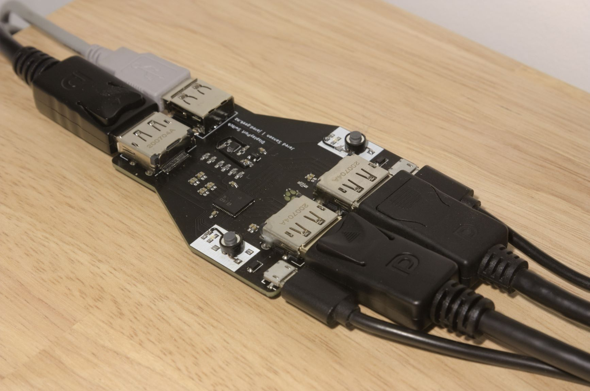

# DPSwitch #

*License: CERN-OHL-S v2*

DPSwitch is a simple KVM-style device that allows you to switch Display Port & USB2.0 between two source devices (eg. a Laptop and a PC):

It is built around the HD3SS215 DP/HDMI mux chip by Texas Instruments, and has a simple flip-flop circuit and two physical buttons to select the input to route to the output. No firmware is required!

I abuse the HD3SS215's HDMI DDC lines to switch USB2.0 signals, and while the datasheet doesn't specify a maximum bandwidth for these lines, it appears to work fine. This avoids the need for a separate mux to switch USB.

## Bill of Materials ##

Qty | Description               | Part Number
----|---------------------------|------------
  1 | DP/HDMI 2:1 Mux 6Gbps     | HD3SS215RTQT
  1 | Dual NAND Gate            | 74LVC2G00DC,125
  1 | 0603 Side look LED (Blue) | KPA-1606QBC-D
  2 | 0603 SMD LED (Green)      | 
  2 | Button (SMD)              | PTS645*
  1 | USB Type-A Conn (TH)      | SS-52100-001
  2 | Micro USB Conn (SMD)      | 609-5379-2-ND 
  2 | Diode                     | BAT54GWJ
  3 | DisplayPort Conn          | MOLEX 47272-0001

Plus various 0603 resistors & capacitors. See schematic.

## Manufacturing ##

Since DP operates in the GHz range, the PCB must be impedance controlled, and utilizes a 4 layer stackup. I used JLCPCB's 4-layer '[JLC7628](https://jlcpcb.com/quote/pcbOrderFaq/PCB%20Stackup)' PCB with a dielectric constant of 4.6, and a black solder mask.

